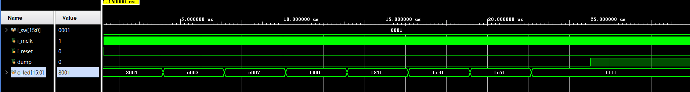
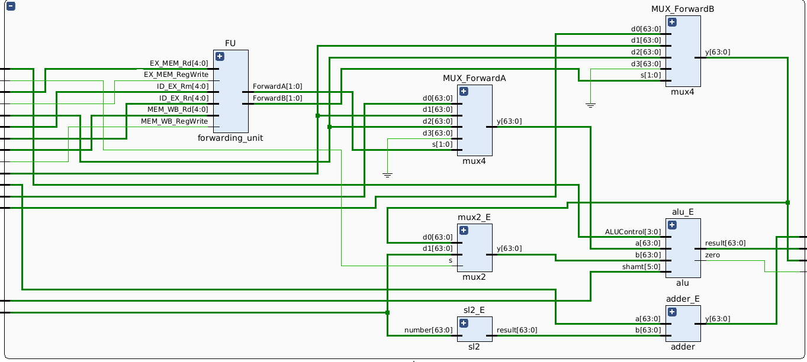
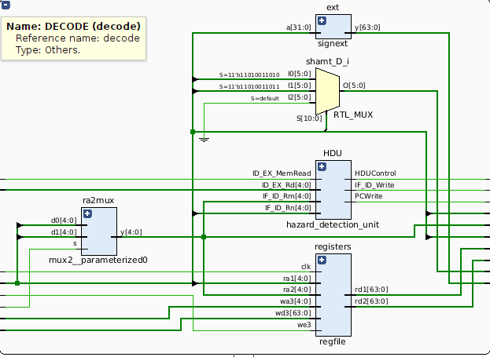
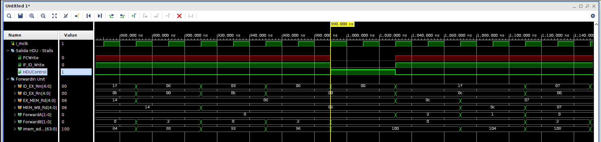
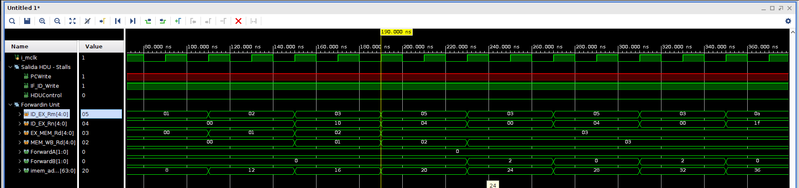

# Arquitectura de Computadoras - FAMAF - UNC

- Tomas Agustin Castrillon DNI: 44974709
- Elián Maximiliano Ghisolfi DNI: 42783852
- Pablo Juarez

## Lab 1: Implementación del procesador LEGv8 con pipeline de 5 etapas

### Implementación del procesador con Pipeline

Se agregaron nuevos módulos y modificaciones al microprocesador ARMv8 en versión reducida obtenida en el trabajo práctico 2.

Módulo `sl2` : Encargado de shiftear 2 bits ya que nuestra memoria está organizada en bloques de a bytes.

Los registros `IF_ID, ID_EX, EX_MEM, MEM_WB`: Son los encargados de dividir y mantener las 5 etapas de nuestro Pipeline  (implementados con módulos `flip-flop`).

---

### Ejercicio 1: Juego de Leds con Switches

Para poder implementar el Juego de Leds con Switches agregamos funcionalidades a nuestro procesador con Pipeline.
Modulo `regfile`: Se le agregó la lógica necesaria para que una instrucción en la etapa `decode`, están siendo escritos como resultado de una instrucción anterior en la etapa `writeback` se obtenga a la salida de `regfile` el valor actualizado del registro .

```sv
assign rd1 = (ra1 == 5'd31) ? regs[31] : (we3 && (wa3 == ra1)) ? wd3 : regs[ra1];
assign rd2 = (ra2 == 5'd31) ? regs[31] : (we3 && (wa3 == ra2))  ? wd3 : regs[ra2];
```

Para agregar las 2 instrucciones `LSR` y `LSL`: Tuvimos que agregar una instrucción shamt de 6 bits en nuestra `ALU` que es el valor inmediato del shift que se realizará.
También se agregaron para ambos casos los opcode en el módulo `maindec`, y sus señales para que `aludec` detecte dichas instrucciones nuevas.

Luego de acondicionar nuestro microprocesador empezamos el análisis de como encender Leds y utilizar Switches en el bloque lógico agregado.

```sv


 always_ff @(posedge mclk)
  if (DM_addr == 64'h8000)
    o_led <= DM_writeData[15:0];
 
 always_comb  
  if (DM_addr == 64'h8008)
       dp_readData = {48'b0, i_sw};
  else
       dp_readData = DM_readData;
```

Entendimos que para poder encender un Led debíamos realizar un modificación de la memoria (`STUR`) en la dirección `0x8000`, como tenemos 16 Leds representados en los 16 bits menos significativos los valores en esta ubicación iban del `0x0000 a 0xFFFF`. Con un analisi similar y como nuestra memoria se direcciona de a 64 bits en la ubicacion `0x8008` tenemos los bits que son modificados por los Switches, es decir, debíamos leer esa ubicación con un `LOAD` donde los 16 bits menos significativos representan los 16 Switches.

**REGISTROS SETEADOS PARA EJERCICIO 1:**
Activando cualquier Switch se activa el primer patrón de luces prendiendo las luces de los extremos hacia el centro, luego desactivando dicho Switch se apagaran las luces desde el centro hacia los extremos.

```
/*
Registros (Pre-cargados) en RegFile.sv:
X9: Contiene 1
X10: Contiene 0x8000 (LEDs)
X25: Contiene 0x400 (Loop)


X15: Patrón DERECHO (Inicia en 0)
X16: Patrón IZQUIERDO (Inicia en 0)
X21: Patrón DERECHA móvil (Inicia en 0x0001)
X23: Patrón IZQUIERDA móvil (Inicia en 0x8000)
X26: Patrón final combinado


segundo patrón
x4: Contiene 0x8008(Switch)
X5: Variable para simular switches (0x0)
x6: patrón derecha móvil (Inicia en 0x00ff)
x7: patrón izquierda móvil (Inicia en 0xff00)
x3: Patron derecho (Inicia en 0)
x2: Patrón izquierdo (Inicia en 0)
x28: pivote (0x7)
x29: pivote (0x7)
*/
```

Como el código tiene casi 100 instrucciones Assembler lo agregamos en la carpeta *TP1-Ej1 -> ejercico1.txt*, la semántica del programa es la siguiente:

1. Bucle `switch` donde esperamos hasta que alguien active el juego de luces, como todos los switches empiezan desactivados si accionamos uno el bucle salta al paso 2.
2. Bucle `main_loop` este es el bucle principal donde al comienzo realizamos la lógica para combinar los bits del Patrón derecho e izquierdo `0x8000 orr 0x0001 = 0x8001` así logramos prender el Led 15 y 0, en la siguiente iteración será `0xc000 orr 0x0003 = 0xc003` así logramos prender el Led 15-14 y 1-0 así sucesivamente hasta `0xffff` que prende los 16 Leds
3. Bucle `wait_loop` es un loop simple parametrizable con `X25: Contiene 0x400 (Loop)`.
4. Bucle `wait_end` es el bucle encargado de verificar en que iteración del bucle `main_loop` estamos y realizar las instrucciones `LSR y LSL` para mover los patrones izquierdo y derecho.
5. El bucle `end` se encarga de ser un bucle infinito y un verificador con una `LDUR a la dirección 0x8008` para ver si el Switch levantado en la el bucle main se bajó, es decir, esa porción de memoria está toda en 0. Si está en 0 salta al paso 6
6. Los bucles `second_bucle, second_wait_loop, second_wait_end y end_main` se encargaran de realizar una lógica parecida al del bucle `main` pero de manera inversa, para así poder apagar todas las Leds

Adjuntamos la simulación donde se ve el análisis de la primera ya que no podemos simular las activaciones y reactivaciones del Switch.

Adjuntamos la simulación donde se ve el análisis de la primera ya que no podemos simular las activaciones y reactivaciones del Switch.

**Simulación**



### Video ejecutando en [FPGA](https://www.amd.com/en/corporate/university-program/aup-boards/realdigital-boolean-board.html)

https://github.com/user-attachments/assets/8d91b65a-2e56-4f50-9b26-cdad73c10776

---

### Ejercicio 2: Implementación de un bloque de detección de hazards (Hazard Detection Unit) y otro de forwarding (Forwarding Unit), a fin de aplicar la técnica de forwarding-stall en caso de la ocurrencia de un data hazard, hasta que el mismo desaparezca.

Basandonos en el capítulo [4.7- “Data Hazards: Forwarding vs Stalling” del libro “Computer Organization and Design - ARM Edition” de D.Patterson y J. Hennessy.](http://home.ustc.edu.cn/~louwenqi/reference_books_tools/Computer%20Organization%20and%20Design%20ARM%20edition.pdf#page=400), le agregamos al procesador con pipeline la capacidad de resolver Data Hazards.

Para ello se agregaron dos nuevas unidades:

### Forwarding (`forwarding_unit`): Para resolver dependencias de datos entre etapas de ejecucion.


**Entradas:** De entradas tiene los registros que vienen de la etapa de IF/ID, y si se estuviese usando alguno en EX/MEM y MEM/WB, asi decidide si a la entrada de la ALU debe poner un resultado nuevo. 

**Salidas:** Las salidas son `ForwardA` y `ForwardB` quienes son encargadas de avisar a la ALU que dato usar, si datos adelantados o datos del banco de registos.

### Hazard Detection Unit - HDU (`hazard_detection_unit`): Para resolver riesgos load-use insertando burbujas (stalls) para detener la ejecucion de instrucciones.


**Entradas:** Detecta si la instrucción en EX es un LDUR (ID_EX_MemRead) y si su destino coincide con alguna fuente de la instrucción en ID (IF_ID_Rn o IF_ID_Rm), si hay risego activa las señales para frenar el pipeline insertando stalls.

**Salidas:**

- PCWrite: Habilitación del PC. Cuando hay riesgo  `PCWrite = 0`.

- IF_ID_Write: Habilitación del registro IF/ID. Si hay riesgo lo congela `IF_ID_Write = 0`.
    
- HDUControl: Control para inyectar una burbuja (NOP). Si hay riesgo `HDUControl = 1`, insertando asi los stalls.

### Otros agregados

Otro bloque que tambien se tuvo que agregar es el `flopre` el cual es un flip-flop con reset y enable. El cual nos permite el congelamiento del pipeline, ya que con el enable permitimos o bloqueamos la escritura del registro IF/ID.

Aqui el [Datapath del procesador](TP1-Ej2/datapath.pdf) se puede ver que es similar al de la imagen del libro [4.59](http://home.ustc.edu.cn/~louwenqi/reference_books_tools/Computer%20Organization%20and%20Design%20ARM%20edition.pdf#page=411)

### Analisis con simulador de vivado
HDU en funcionamiento



```assembly
LDUR X12, [X0, #0] ; (Carga dato en X12)

ADD X7, X12, XZR ; (Intenta usar X12 inmediatamente después)
```

Vemos como el PC llega al ADD y la HDU detecta que la instruccion actual necesita leer un registo que la instruccion anterior LDUR va a escribir, vemos como HDUControl se pone en 1 haciendo stall y se bloquea el PC, congelando el ADD hasta que el dato este.

Forwarding Unit en funcionamiento



```assembly
SUB X3, X4, X5 ; (PC 20: Escribe el resultado en X3)

STUR X3, [X0, #32] ; (PC 24: Lee X3 para guardarlo en memoria)
```

Con el PC= 20 se ejecuta la resta (SUB),  su resultado (el nuevo valor de X3) se genera en la ALU pero aún no se escribe en el registro, viene el PC = 24 y entra la instruccion STUR que necesita el valor de X3, vemos como la señal ForwardB toma el valor `10`, valor `10` en el multiplexor de adelantamiento indica que el dato se está tomando directamente desde la etapa EX/MEM (el resultado del SUB anterior) en lugar de leer el valor desactualizado del banco de registros. Esto permite que la instrucción STUR se ejecute correctamente en el mismo ciclo sin pausas. 

