# Arquitectura de Computadoras - 2025
## Informe Lab2:  Análisis de microarquitecturas

## Integrantes:

 - Tomas Agustin Castrillon DNI: 44974709 
 - Elián Maximiliano Ghisolfi DNI:42783852
 - Alumno

## Introducción 

En este trabajo de laboratorio se busca analizar de manera práctica cómo las decisiones de diseño en la micro-arquitectura de un procesador influyen directamente en su rendimiento (performance). La velocidad de ejecución de un código no depende únicamente del software, sino fundamentalmente de cómo el hardware subyacente maneja tareas como el acceso a memoria y la ejecución de instrucciones. Para llevar a cabo este análisis, se utilizó el simulador **gem5**. Esta es una herramienta avanzada de simulación que permite modelar distintos componentes del microprocesador con una alta precisión. 

La investigación de este informe se enfoca en tres ejes principales:

1. **Jerarquía de Memoria:** Se estudia cómo impactan en la performance las variaciones en los tamaños y la asociatividad de la memoria caché.
2. **Riesgos de Control:** Se analiza la efectividad de diferentes estrategias de predicción de saltos.
3. **Tipo de Ejecución:** Se compara el rendimiento de un procesador simple con ejecución en orden (in-order) contra uno más complejo con ejecución fuera de orden (out-of-order).

A lo largo de este documento se presentarán los resultados de las simulaciones realizadas para cada uno de estos escenarios, junto con el análisis y las justificaciones correspondientes.

## Análisis Ejercicio 1

Se realizó un benchmark (inciso a) basado la rutina principal del LINPACK Benchmark. Donde se destaca **3 accesos a memoria** (2 de lectura y 1 de carga) en el bucle principal junto con operaciones aritméticas de punto flotante: 

```assembly
   // x10 tiene la dirección de Alpha en d0 
    ldr     d0, [x10]

    // Inicializar x5 con el índice 'i'.
    mov     x5, 0       // i = 0

.loop_start:
    // Comparamos el índice con N (que está en x0)
    cmp     x5, x0
    b.ge    .loop_end

    // Cargar X[i] en un registro flotante (d1)
    ldr     d1, [x2, x5, LSL 3]  // d1 = X[i]

    // Cargar Y[i] en un registro flotante (d2)
    ldr     d2, [x3, x5, LSL 3]  // d2 = Y[i]

    // Calcular alpha * X[i]
    // d3 = d0 (alpha) * d1 (X[i])
    fmul    d3, d0, d1

    // Calcular (alpha * X[i]) + Y[i]
    fadd    d3, d3, d2           // d3 = Z[i]

    // Almacenar el resultado en Z[i]
    str     d3, [x4, x5, LSL 3]  // Z[i] = d3

    add     x5, x5, 1            // i++

    b       .loop_start

.loop_end:
```

Para el análisis de este ejercicio vamos a observar 4 métricas:

-  numCycles: Es el número total de **ciclos de clock** que le tomó al procesador ejecutar esas instrucciones. Esta es la métrica principal para medir el tiempo de ejecución. 
- idleCycles: Es el número total de ciclos en los que el procesador estuvo **detenido o sin hacer trabajo útil**. Generalmente ocurre cuando está stalleando esperando que la memoria traiga un dato (un fallo de caché u otro motivo).
- overallHits: Número de veces que se fue a buscar un dato y **estaba** en la caché (acierto).
- ReadReq.hits: Total de aciertos **solo de lectura**.

| Configuracion del procesador | numCycles | idleCycles | overallHits | ReadReq.hits |
| ---------------------------- | --------- | ---------- | ----------- | ------------ |
| 32KB - Mapeo directo         | 221457    | 141098     | 798         | 477          |
| 16KB - Mapeo directo         | 221437    | 141078     | 798         | 477          |
| 8KB - Mapeo directo          | 221393    | 141034     | 798         | 477          |
| 32KB - 2 Vias                | 188760    | 118597     | 4769        | 4694         |
| 16KB - 2 vias                | 188837    | 118781     | 4782        | 4706         |
| 8KB - 2 vias                 | 189265    | 119166     | 4781        | 4714         |
| 32KB - 4 vias                | 243075    | 187452     | 10755       | 7685         |
| 16KB - 4 vias                | 243075    | 187452     | 10755       | 7685         |
| 8KB - 4 vias                 | 243163    | 187542     | 10755       | 7685         |
| 32KB - 8 vias                | 243075    | 187452     | 10755       | 7685         |
| 16KB - 8 vias                | 243075    | 187452     | 10755       | 7685         |
| 8KB - 8 vias                 | 243027    | 187407     | 10755       | 7685         |

Para este primer análisis tendremos en cuenta los incisos b), c) y d) respectivamente. Teniendo en cuenta las métricas que miden la cantidad de aciertos en la memoria caché (L1 de datos).

| overallHits                                     | ReadReq.hits                                     |
| ----------------------------------------------- | ------------------------------------------------ |
| 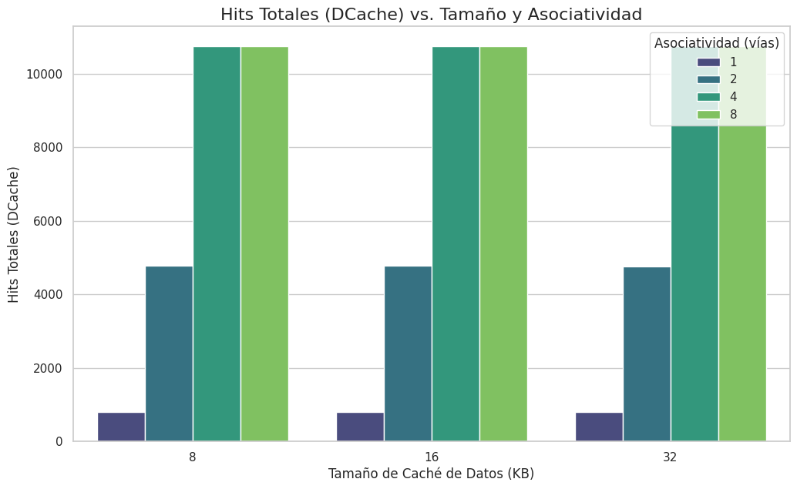</img> | 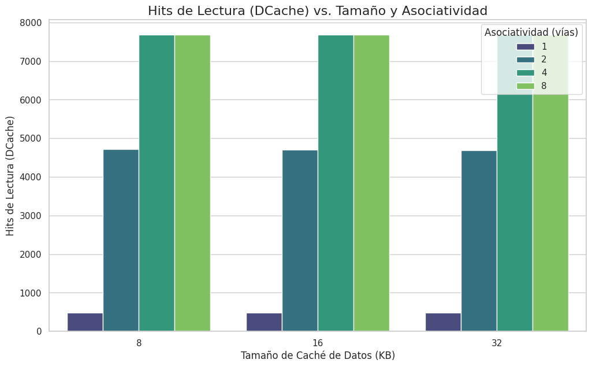</img> |
| Figura 1.1                                      | Figura 1.2                                       |

En primera instancia podemos observar como nuestro procesador con la configuración de caché de vía directa (8KB, 16KB y 32KB) tiene una cantidad muy baja  de aciertos en el orden de los 800 aciertos para cada tamaño, esto se debe principalmente a que en cada iteración los accesos a memoria provocan un escenario de **thrashing**:

```assembly
ldr d1, [X[i]] -> Trae el bloque de X a la caché. (Miss)

ldr d2, [Y[i]] -> Reemplaza el bloque de X y trae el bloque de Y. (Miss)

str d3, [Z[i]] -> Reemplaza el bloque de Y y trae el bloque de Z. (Miss)

(Siguiente iteración) ldr d1, [X[i+...]] -> ¡Patea el bloque de Z! (Miss)
```

Esta observación deriva de que tenemos 4096 * 3 accesos de memoria en el bucle principal y solo tenemos ~800 Hits. 

Cuando aumentamos la cantidad de vías a una **caché asociativa de 2 vías** vemos una mejora sustancial ya que ahora cuando traemos un bloque que pertenece al mismo conjunto (Set) que el bloque anterior ahora tenemos una vía mas para almacenarlo, podemos guardar `X[i]` y `Y[i]` en el mismo Set.

Luego podemos observar que para las **caché asociativas de 4 y 8 vías** la cantidad de Hits totales y de lectura aumentan a casi el ideal pero no llegan al ideal ya que como la línea/bloque de caché es de 64 bytes y tus datos son de 8 bytes, tienes 7 Hits por cada Miss. Pero vemos que en ambas configuraciones de caché se mantienen iguales esto es por que al tener solo 3 accesos de memoria en el bucle principal llegamos al máximo de eficiencia solo con 3 vías tener mas vías no mejorará los resultados 

Ahora vamos a observar las métricas de **numCycles y idleCycles** para ver como mejora la ejecución completa del código en cantidad de ciclos de clock.


| Ciclos Totales                                     | Ciclos Ociosos                                    |
| -------------------------------------------------- | ------------------------------------------------- |
| 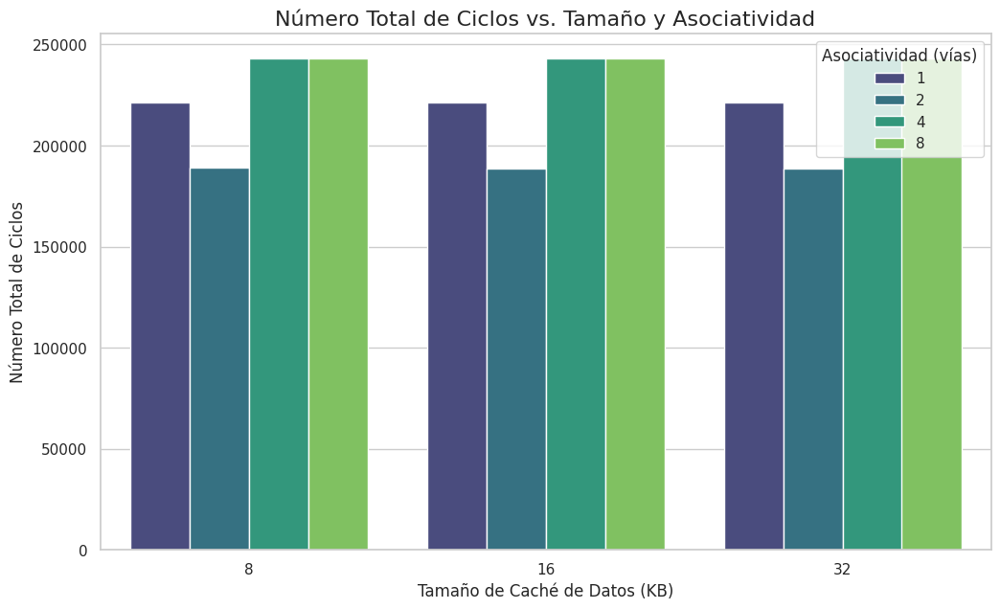</img> | 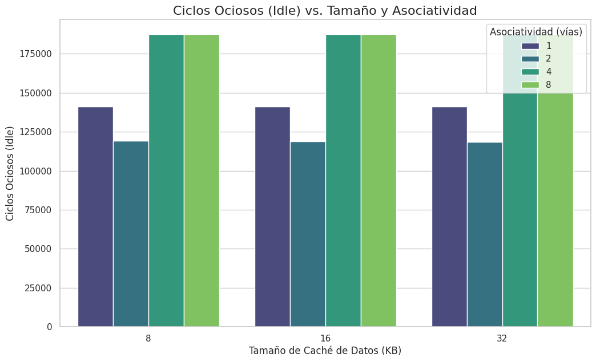</img> |
| Figura 1.3                                         | Figura 1.4                                        |

En ambas figuras podemos ver como la cantidad de ciclos ociosos es proporcional a la cantidad de ciclos totales, esto debido a que cada Miss de memoria genera una penalización en ciclos que se pierden. Podemos observar una gran disminución en ciclos ociosos y cantidad de ciclos totales esto resultado del análisis anterior. 

<a id="referencia-2c"></a>
Luego para las **caché asociativas de 4 y 8 vías** deberíamos observar una disminución mayor a la **caché de 2 vías** ya que como vimos anteriormente a partir de las 4 vías en la caché se logra la máxima eficiencia de Hits pero curiosamente no vemos esto reflejado en la cantidad de ciclos totales y de ciclos ociosos. Podemos atribuir este comportamiento a la complejidad de tener mas vias.

Cuando el procesador pide un dato a la caché, esta debe realizar dos pasos:

1. **Revisar los Tags:** Mira en el "conjunto" (set) correspondiente para ver si el dato *está* (hit) o *no está* (miss).
2. **Entregar el dato:** Si es un hit, entrega el dato al procesador.

Y el problema está en el revisar el Tag:

- **Mapeo Directo (1 Vía):** La caché solo tiene que revisar **1 Tag**. Es simple y muy rápido.
- **Asociativa de 2 Vías:** Tiene que revisar **2 Tag** al mismo tiempo y compararlas. Esto requiere más hardware (comparadores) y un multiplexor 2-a-1 para seleccionar el dato. Es *ligeramente* más lenta.
- **Asociativa de 4 Vías:** Tiene que revisar **4 Tag** en paralelo. Esto requiere 4 comparadores y un multiplexor 4-a-1. Es *significativamente* más compleja y, por lo tanto, más lenta.
- **Asociativa de 8 Vías:** Aún más complejo y lento.

**Punto E)**

Lo que se hizo para obtener resultados similares o mejores que una cache de 2 vias, fue loop unrolling de las instrucciones, ahora el codigo se veria algo asi:

```c
for (int i = 0; i < N; i+=4 )
{
    Z[i] = alpha * X[i] + Y[i];
    Z[i+1] = alpha * X[i+1] + Y[i+1];
    Z[i+2] = alpha * X[i+2] + Y[i+2];
    Z[i+3] = alpha * X[i+3] + Y[i+3];
}    
```
y ademas ya que assembler nos permite, se hizo reordenamiento para leer todos los X's juntos, luego los Y's, calcular los resultados y al final guardar todos los Z's juntos, disminuyendo los misses y amuentando considerablemente los hits.

[CODIGO COMPLETO](https://github.com/UNC-FAMAF/adc2025-lab2-adc2025-g31/blob/main/benchmarks/ej_daxpy_enhanced.s)

Pero veamos esto en los graficos.

| Ciclos                                 | Hits                                 |  
|----------------------------------------|--------------------------------------|
|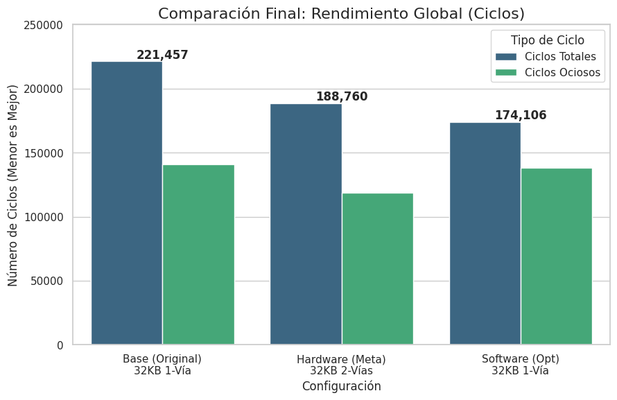</img>|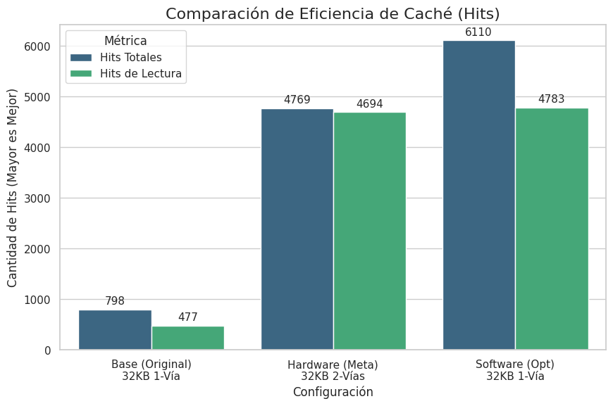</img>|
| Figura 1.5                             | Figura 1.6                           |

- **Figura 1.5:** Podemos observar como los ciclos bajan cosiderablemente respecto a la cache de 1 via con el benchmark sin mejoras, estan hasta mas bajos que los ciclos de la cache de 2 vias.

- **Figura 1.5:** Aqui se ve como los hits son casi un 665% mas si comparamos la cache de 1 via con benchmark sin mejoras y benchmark con mejoras.

Esto se debe a que al acceder asi a los datos:

```assembly
    ldr     d1, [x2, #0]    // d1 = X[i]      (Genera MISS)
    ldr     d3, [x2, #8]    // d3 = X[i+1]    (Esto es un HIT)
    ldr     d5, [x2, #16]   // d5 = X[i+2]    (HIT)
    ldr     d7, [x2, #24]   // d7 = X[i+3]    (HIT)
```
La linea de cache se llena con el primer miss, luego los 3 proximos accesos a X son HIT's, esto se repite con los demas acceso a cache.

**Punto D)**
A partir de las mejoras de rendimiento estaticas de *Loop-Unrolling* obtivimos la siguiente tabla comparativa entre el procesador *In Order* y el procesador *Out of Order* ambos con una caché de 32KB de Mapeo Directa.

| Configuracion del procesador y caché | numCycles | idleCycles | overallHits | ReadReq.hits |
| ------------------------------------ | --------- | ---------- | ----------- | ------------ |
| 32KB - Mapeo directo - Out of Order  | 37112     | 220        | 3057        | 2545         |
| 32KB - Mapeo directo - In Order      | 174106    | 137929     | 6110        | 4783         |

Primero veamos la cantidad de ciclos ociosos **idleCycles** la diferencia es inmensa en el procesador *Out of Order* casi no tenemos ciclos ociosos ~220 ciclos ociosos esto se debe a que cuando este procesador encuentra un fallo de caché, **NO se detiene**. Gracias al *Loop Unrolling*, hay muchas instrucciones independientes (`fmul`, otras `ldr`, cálculo de direcciones). El procesador deja pendiente la carga que falló y **sigue ejecutando** todas esas otras instrucciones útiles. Básicamente, está trabajando en varias partes del bucle al mismo tiempo.

Mientras que en el procesador *In Order*, cuando ejecuta una instrucción de carga (ej. `ldr d1, [X]`) y ocurre un fallo de caché (Miss), el procesador **se stallea**. No puede hacer nada más hasta que el dato llegue desde la memoria. Como tenemos una caché de Mapeo Directo (propensa a conflictos) y estamos manejando 3 vectores grandes, los Miss son frecuentes. El CPU pasa la mayor parte del tiempo stalleado (ciclos ociosos).

|Ciclos                                                           |
|-----------------------------------------------------------------|
|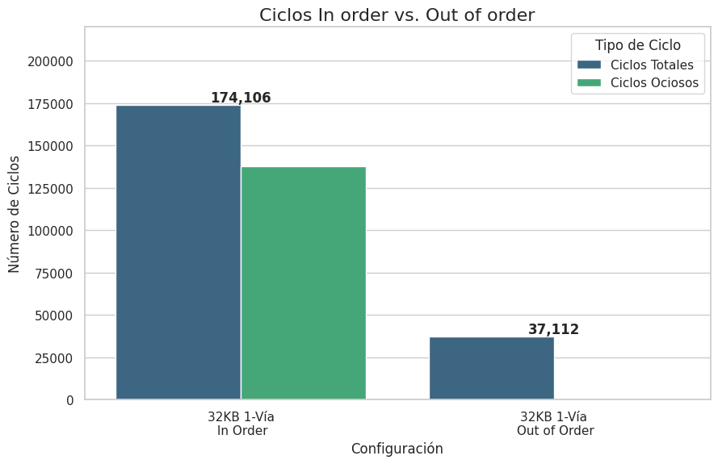</img>|
|Figura 1.7                                                       |

En conclusión el poder del procesador *Out of Order* está en no sufrir stalls cuando ocurre un fallo de memoria y poder ir realizando otros cálculos con los datos que ya tiene o que va a tener cuando se resuelva el fallo de la memoria caché.

## Análisis Ejercicio 2

**Punto A y B:**

Benchmark en C:

```c
#define N 1024
int X[N], Y[N], Z[N];
int contador_mod = 0; 
int i = 0;
do{
    // Condición: ¿Es el contador distinto de 2? (Es decir, es 0 o 1)
    if (contador_mod != 2) { 
        // RAMA TAKEN (Se toma el salto)
        Z[i] = X[i] + Y[i];
        contador_mod++; 
    } else {
        // RAMA NOT TAKEN (No se toma el salto)
        Z[i] = X[i] - Y[i]
        // Reset al contador para volver al patron
        contador_mod=0;
    }
    i++
}while i < N;
```

La idea principal es crear un bucle lo suficientemente largo para que los predictores de saltos que están a prueba puede entrenarse y podamos lograr un análisis critico. Luego creamos un patrón complejo que cambia cada 3 iteraciones.

```c
contador_mod = 0 -> Taken y bucle -> Taken
contador_mod = 1 -> Taken y bucle -> Taken
contador_mod = 2 -> No Taken y bucle -> Taken
```

Este tipo de patrón hace que el comportamiento dentro del bucle cambie cada 3 iteraciones entonces un **Predictor Local** debería fallar en esta instancia ya que se "acostumbro" al comportamiento de las otras 2 iteraciones. 

Cabe destacar que si tuviéramos un **Predictor Local** de 8 bits con una estructura que tuviera un patrón de 8 predicciones lograríamos entrenar de tal forma que podríamos predecir todos los saltos. 

A continuación mostraremos una tabla comparativa entre dos configuraciones del procesador *In Order*

| Configuracion del procesador        | lookups | condIncorrect | condPredicted |
| ----------------------------------- | ------- | ------------- | ------------- |
| BP_local con caché Directa 8KB      | 4136    | 348           | 3770          |
| BP_tournament con caché Directa 8KB | 2458    | 10            | 2080          |

Observamos que **Predictor Torneo** tuvo solo 10 fallos en 2080 predicciones. Podemos deducir que esos 10 fallos son el entrenamiento inicial del predictor a la estructura y patrones del código del Benchmark, una vez aprendido no tuvo mas fallos.

Por otro lado, si observamos el patrón interno del Bucle:

```c
contador_mod = 0 -> Taken
contador_mod = 1 -> Taken
contador_mod = 2 -> No Taken
```

Es un patrón T, T y NT y en total tenemos 1024 saltos dentro del bucle, ahora el **Predictor Local** tuvo 348 predicciones incorrectas esta cantidad la podemos atribuir a mala predicciones dentro del bucle ya que el patrón T, T, NT en las iteraciones donde el contador_mod es 0 y 1 satura el predictor en **11 Strongly Taken** y cuando llega contador_mod = 2 la predicción es incorrecta (T en vez de NT), es decir, que el predictor local dentro de este bucle falla 1/3 de las veces

Para analizar el Miss Rate utilizamos la formula ***condIncorrect / (condPredicted + condIncorrect):***

|                                     | Miss Rate      |
| ----------------------------------- | -------------- |
| BP_local con caché Directa 8KB      | 0.08450704225  |
| BP_tournament con caché Directa 8KB | 0.004784688995 |

 Aca podemos observar que la gran diferencia que existe en el **Miss Rate** entre el **Predictor Local** y el **Predictor por Torneos** a favor del predictor por torneos que es una orden magnitud menor al predictor local. 

Un detalle curioso que tuvimos que investigar es que los valores de *condPredicted* nos dan diferentes ya que cada vez que el Predictor Local se equivocaba (348 veces), el procesador entraba por el camino equivocado (Wrong Path), cargaba instrucciones que no debía ejecutar, intentaba predecir saltos dentro de ese camino erróneo (si hubiéramos hecho un benchmark mas complejo con mas condiciones adentro seria mas costoso para el micro) y llenaba el pipeline de basura. Cuando se daba cuenta del error, tenía que *Flushear*. Esto demuestra que **una mala predicción no solo cuesta tiempo, sino que desperdicia clk procesando instrucciones que luego se descartan.**

**Punto C y D**

Ahora vamos a modificar la caché para analizar si la misma influye en la predicción de saltos. 

| Ciclos                                 | Predictor por torneo                      |
|----------------------------------------|-------------------------------------------|
|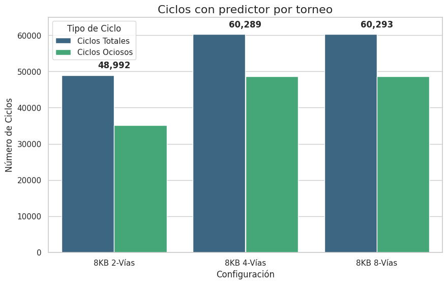</img>|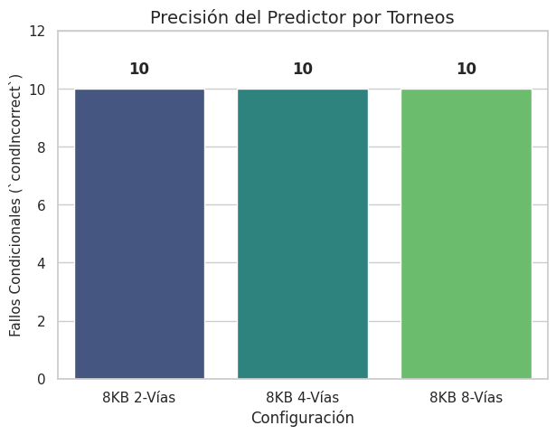</img>|
| Figura 2.1                             | Figura 2.2                                |

Como se observa en la `Figura 2.2` el predictor por torneos siempre tiene la **misma** cantidad de fallas independientemente de la cantidad de vías de la caché.
Ahora si observamos la `Figura 2.1` la configuración de caché mas eficiente es la de 2-vías, mientras que con la de 4 y 8 tenemos un 23% mas de ciclos.

A que se debe esto? 
[Aquí](#referencia-2c) explicamos mas arriba a que podíamos atribuir este fenómeno.


Ahora veamos como es el comportamiento de un procesador **Out of Order** con este predictor por torneo y la mejor configuración de cache según vimos antes.

| Config. del procesador                         | numCycles | idleCucles | condIncorrect | condPredicted |
|------------------------------------------------|-----------|------------|---------------|---------------|
| 8KB 2-vias In Order (Predictor por torneo)     |     48992 |      35181 |            10 |          2066 |
| 8KB 2-vias Out of Order (Predictor por toreno) |     24000 |        310 |            12 |          2065 |

| Ciclos                                 | Predictor por torneo                      |
|----------------------------------------|-------------------------------------------|
|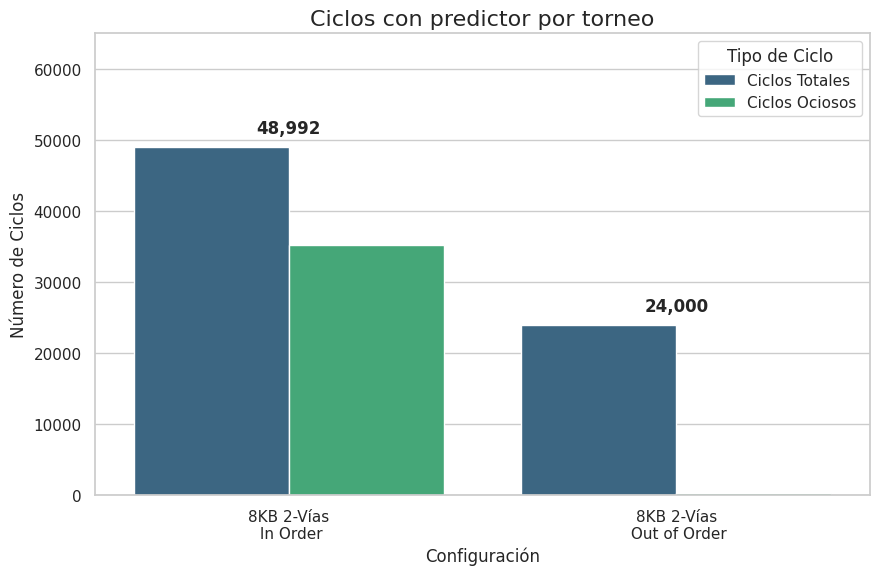</img>|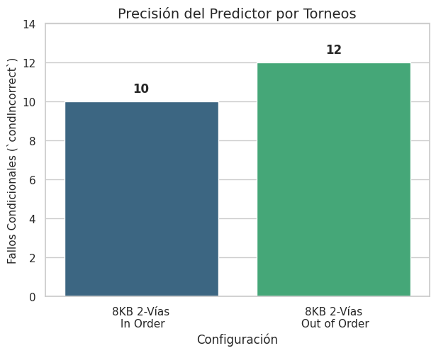</img>|
| Figura 2.3                             | Figura 2.4                                |

Como podemos observar en la `Figura 2.3` los ciclos bajan un 50% en el procesador Out of Order en comparacion con el procesador In Order, pero al ver la `Figura 2.4` vemos un 20% mas de *condIncorrect*.


## Conclusión  

A lo largo de esta proyecto pudimos abordar varias configuraciones de **Memorias Caché** y **Predictores de Salto** analizando diferentes métricas tales como numero de ciclos totales, ciclos ociosos, predicciones incorrectas, entre otras. donde cada uno nos indicaba la mejor configuración en ese aspecto finalmente pudimos determinar que un **Procesador Out of Order con una caché de 2 Vías de 8KB con un Predictor de Salto por Torneo**  es la mejor configuración no solo a nivel técnico por todo el análisis de este proyecto si no también a nivel de complejidad y costos ya que tener mas vías implica complejidad combinacional y caché de mayor tamaño implica mayores costos.

Por ultimo dejaremos el **CPI** en los 3 **Benchmark**  analizados de la primera configuración **Procesador In Order con una caché Directa de 32KB con un Predictor de Salto Local** vs **Procesador Out of Order con una caché de 2 Vías de 8KB con un Predictor de Salto por Torneo** 

|                                         | CPI daxpy | CPI daxpy_unrolling | CPI branchPD |
| --------------------------------------- | --------- | ------------------- | ------------ |
| **In Order - Directa 32KB BP Local**    | 6.01      | 6.29                | 6.53         |
| **Out of Order - 2 Vias 8KB BP Torneo** | 1.01      | 1.33                | 2.27         |