## Laboratorio 3.Capa de transporte. Control de flujo y congestión.
Cátedra de Redes y Sistemas Distribuidos

Integrantes:

- Bustamante, Malena

- Castrillon, Tomas

- Ghisolfi, Elian

- Moisset, Hernan

## ABSTRACT/RESUMEN

Este trabajo de laboratorio explora los conceptos de control de flujo y congestión en redes de computadoras mediante simulación discreta utilizando OMNeT++. Se analizaron dos casos de estudio con una topología de red específica (Generator - NodeTx - Queue - NodeRx - Sink) para identificar problemas inherentes a la capacidad de los nodos y de la red.

En el Caso 1, se evidenció un problema de control de flujo debido a que la tasa de salida del Queue(Rx) (hacia el Sink) era menor que la tasa de llegada, lo que provocó el llenado y desborde del buffer del receptor (NodeRx), resultando en pérdida de paquetes.

En el Caso 2, se identificó un problema de control de congestión donde la tasa de transmisión entre la Queue (actuando como un enrutador o varios) y el NodeRx era un cuello de botella, llevando al llenado y potencial desborde del buffer de la Queue.

Para abordar estos problemas, se diseñó e implementó una solución que involucra dos algoritmos:

- Un algoritmo de control de congestión, que utiliza el retardo de los paquetes para ajustar dinámicamente la tasa de envío del NodeTx enviandole un `FeedbackPkt`, luego el NodeTx va aumentando gradualmente su velocidad de transmisión.

- Un algoritmo de control de flujo donde el NodeRx envía un `FeedbackPkt` al NodeTx cuando su buffer se acerca a la saturación, indicando que el emisor debe reducir su velocidad de transmisión, luego NodeTx va aumentando gradualmente su velocidad de transmisión.

Los resultados de la simulación con estos algoritmos implementados (analizados en los Casos 1 y 2 de la Parte 2) mostraron una mejora en la gestión de los buffers y una reducción en la pérdida de paquetes. En el Caso 1 (control de flujo), se observó una oscilación en el llenado del buffer del receptor, evitando su saturación completa, por consecuente no hay perdida de paquetes. En el Caso 2 (control de congestión), se buscó una adaptación de la tasa de envío a las condiciones de la red.

La discusión final del informe plantea posibles mejoras a los algoritmos implementados, como ajustar los umbrales para el control de flujo y analizar en detalle el comportamiento y limitaciones del algoritmo de control de congestión. Además, se menciona la intención de implementar un protocolo más completo como TCP en futuros trabajos. Finalmente, se destaca el uso de herramientas de inteligencia artificial para la creación de visualizaciones de datos y la mejora de la redacción del informe.

## INTRODUCCION

En el ámbito de las redes de computadoras, la gestión eficiente de los recursos es fundamental para garantizar una comunicación fluida y confiable. Dos aspectos cruciales en esta gestión son el **control de flujo** y el **control de congestión**.

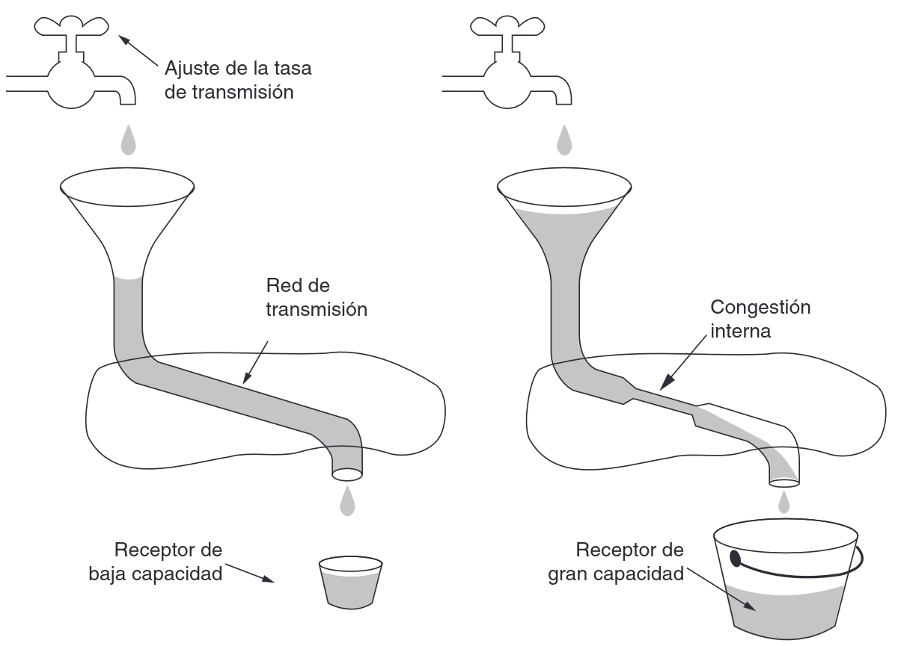

El **control de flujo** se enfoca en evitar que un transmisor rápido abrume a un receptor más lento, asegurando que los datos se envíen a una velocidad que el receptor pueda procesar. Por otro lado, el **control de congestión** aborda el problema de la sobrecarga en la red, donde demasiados paquetes compiten por los recursos, lo que puede llevar a una disminución significativa del rendimiento.

Para analizar y solucionar problemas relacionados con estos aspectos, se recurre a menudo a la **simulación de redes**. Este enfoque permite modelar el comportamiento de la red bajo diversas condiciones y probar diferentes algoritmos y protocolos antes de su implementación en sistemas reales.

En el presente trabajo, se ha utilizado el entorno de simulación **OMNeT++** para investigar y proponer una solución a problemas de congestión y flujo en una red. A través de la implementación de un algoritmo específico, se busca mejorar la eficiencia y la calidad del servicio de la red simulada.

## PARTE 1 ANALISIS

### Red Utilizada
Utilizamos la siguiente red, la cual nos fue indicada como implementar por la catedra

| Network                                                        | NodeTx                                                       | NodeRx                                                         |
|----------------------------------------------------------------|--------------------------------------------------------------|----------------------------------------------------------------|
| 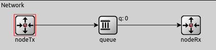</img>|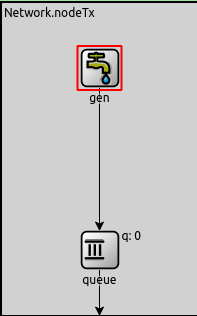</img>|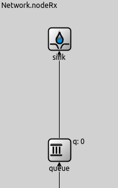</img>  |
| Figura 0.1                                                     | Figura 0.2                                                   | Figura 0.3                                                     |

### CASO 1:

-NodeTx a Queue: datarate = 1 Mbps y delay = 100 us

-Queue a NodeRx: datarate = 1 Mbps y delay = 100 us

-Queue a Sink: datarate = 0.5 Mbps

En el Caso de Estudio 1, la configuración de las tasas de transmisión revela un cuello de botella significativo entre Queue(Interna del NodeRx) y Sink, con una capacidad de 0.5 Mbps. Dado que la tasa potencial de llegada de datos a NodeRx desde Queue es de 1 Mbps, la tasa de salida hacia Sink es insuficiente para drenar el tráfico entrante.

Como resultado, el buffer de recepción en NodeRx, con un tamaño máximo de 200 paquetes (según la configuración general de las colas), comenzará a llenarse. Una vez que este buffer alcance su capacidad máxima, cualquier paquete adicional que llegue a NodeRx se perderá debido al desbordamiento del buffer. Ya que el mismo empieza a dropear estos paquetes.
Este caso tendriamos un problema de un receptor lento, para solucionar esto se necesita un control de flujo.

| NodeTx                                             | Queue                                             | NodeRx                                             |
|----------------------------------------------------|---------------------------------------------------|----------------------------------------------------|
|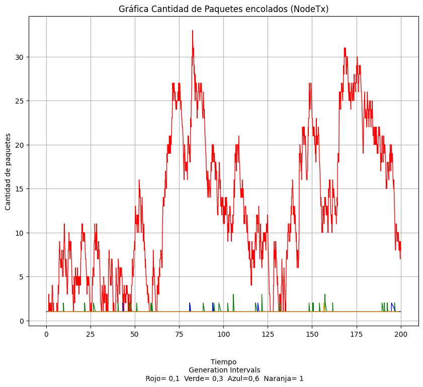</img>|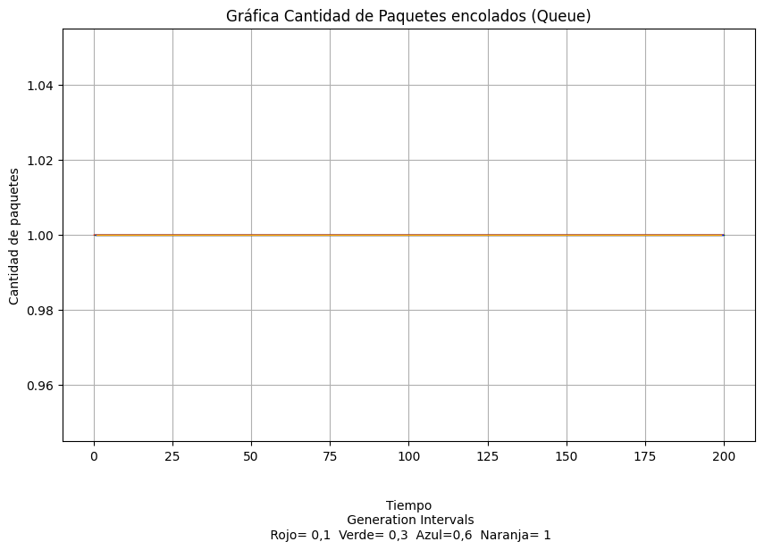</img>|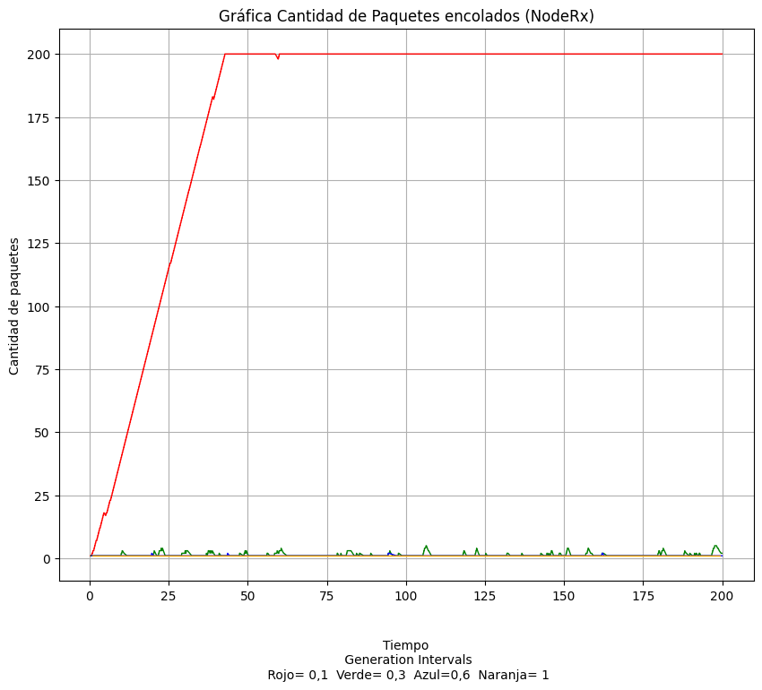</img>|
| Figura 1.1                                         | Figura 1.2                                        | Figura 1.3                                         | 

**Figura 1.1 :** Debido a un generationInterval con `exponecial()` no siempre es constante la generacion de paquetes, por ello a veces tenemos mas paquetes encolados y luego muchos menos.

**Figura 1.2 :** Como su tasa de transferencia es igual que la de llegada y su `ServiceTime=0` despacha los paquetes inmediatamente le llegan y a la misma velocidad.

**Figura 1.3 :** Aqui se encuentra el problema detallado anteriormente.

### CASO 2:

-NodeTx a Queue: datarate = 1 Mbps y delay = 100 us

-Queue a NodeRx: datarate = 0.5 Mbps y delay = 100 us

-Queue a Sink: datarate = 1 Mbps

En el Caso de Estudio 2, la configuración de las tasas de transmisión revela un cuello de botella significativo entre Queue y NodeRx, con una capacidad de 0.5 Mbps. Dado que la tasa potencial de llegada de datos a Queue desde NodeTx es de 1 Mbps, la tasa de salida hacia NodeRx es insuficiente para drenar el tráfico entrante.

Como resultado, el buffer en Queue, con un tamaño máximo de 200 paquetes (según la configuración general de las colas), comenzará a llenarse. Una vez que este buffer alcance su capacidad máxima, cualquier paquete adicional que llegue a Queue desde NodeTx se perderá debido al desbordamiento del buffer.
En este caso Queue podriamos definirla como la "red de enrrutadores" entonces estariamos en un caso de congestion de la red, para ello se necesitaria un control de congestion.

| NodeTx                                              | Queue                                             | NodeRx                                             |
|-----------------------------------------------------|---------------------------------------------------|----------------------------------------------------|
| </img>|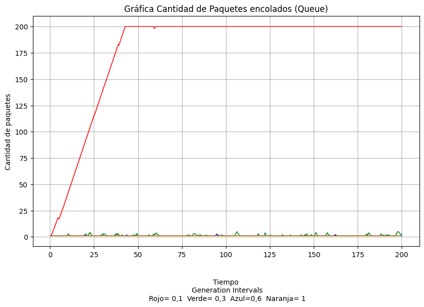</img>|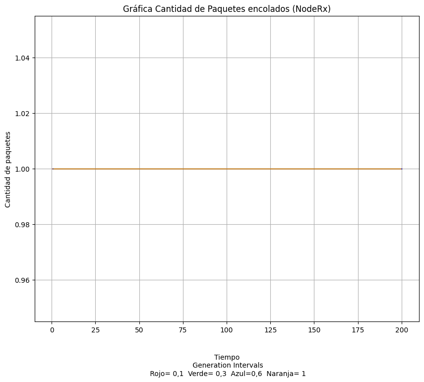</img>|
| Firgura 2.1                                         | Figura 2.2                                        | Figura 2.3                                         |

**Figura 2.1 :** Similar al del caso 1.

**Figura 2.2 :** Aqui vemos como se llena la cola intermedia, problema detallado antes.

**Figura 2.3 :** Como su tasa de ingreso es menor a la de transferencia, no hay problema y apenas nos llega un paquete lo enviamos

### Extras

| Carga ofrecida vs Carga util                      | Carga ofrecida vs Retardo                          |
|---------------------------------------------------|----------------------------------------------------|
|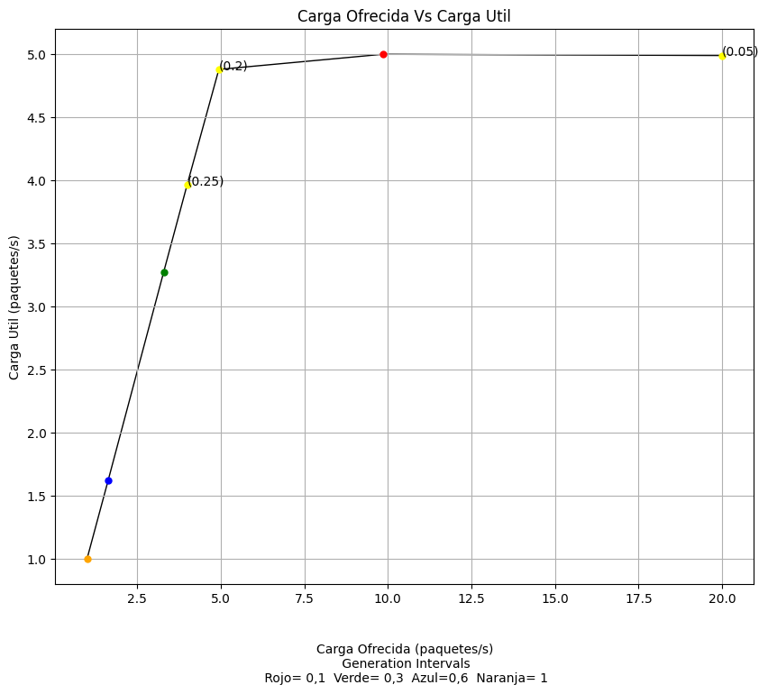</img>|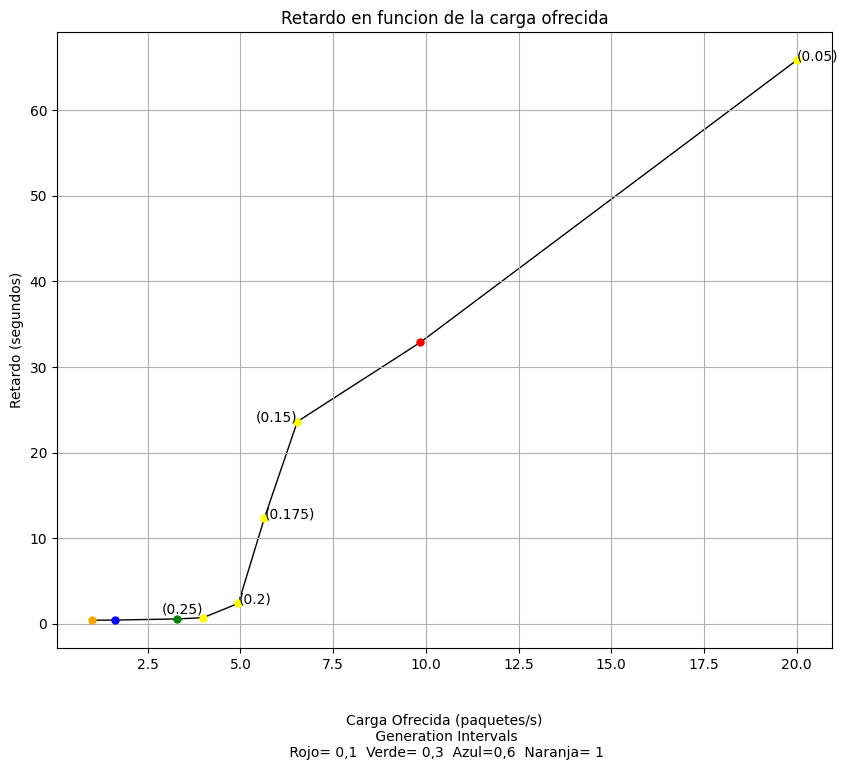</img>|
| Figura 3.1                                        | Figura 3.2                                         |

**Figura 3.1 :** Aqui podemos observar como las velocidades de transferencia limitan la cantidad de paquetes que llegan a destino. 

**Figura 3.2 :** En este grafico podemos ver que hasta 5 (paquetes/s) la red no tiene retardo, esto es porque todavia no llegamos a la capacidad maxima de la red, entonces no hay paquetes encolados, si vemos el grafico de la izquierda podemos ver que la capacidad maxima de la red son 5 (paquetes/s), cuando empezamos a generar mas de 5 (paquetes/s) los paquetes se empiezan a encolar, y por ende demorar mas tiempo en llegar a destino. 

## PARTE 2 DISEÑO

### Red Utilizada

| Network                                                        | NodeTx                                                       | NodeRx                                                         |
|----------------------------------------------------------------|--------------------------------------------------------------|----------------------------------------------------------------|
| 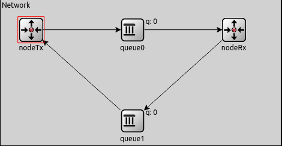</img>|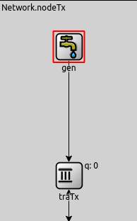</img>|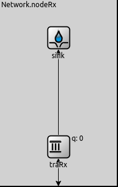</img>  |
| Figura 4.1                                                     | Figura 4.2                                                   | Figura 4.3                                                     |

Aqui podemos ver en la Figura 4.1 que a diferencia de la Figura 0.1 añadimos una nueva `queue1` la cual utilizaremos para los `FeedbackPkt's`.

En la Figura 4.2 se cambia la anterior `queue` de la Figura 0.2 por la ahora `traTx` la cual es similar a la anterior, pero nos permite leer estos `FeedbackPkt's` pudiendo asi controlar los problemas de flujo y congestion.

En esta otra Figura 4.3 cambiamos las `queue` por `traRx` la cual es capaz en enviar un `FeedbackPkt` cuando la red esta congestionada o cuando su buffer se esta por saturar.

## METODOS

### Algoritmo de control de congestión
Para mitigar la congestión en la red, se implementó un algoritmo de control de congestión inspirado en los mecanismos utilizados por TCP Vegas. Este algoritmo se basa en señales implícitas manejadas en el tiempo, creando un nuevo evento (`cMessage *congestionMessage`) que sucede cada 6 segundos (`scheduleAt(simTime() + 6, congestionMessage)`). Estas señales utilizan el incremento del retardo (`delay`) de los paquetes recibidos (`currenteDelay`) para calcular el mismo se utiliza un análisis del tiempo en el que sale el paquete (`pkt->setTimestamp()`) para establecer cuándo enviamos el paquete a la red desde el NodoTx y el tiempo de llegada al módulo NodoRx (`currenteDelay = simTime() - msg->getTimestamp()`) para detectar condiciones de congestión y poder crear un promedio del delay real de la red (`avgDelay`) sin tener en cuenta el buffer de salida del módulo TransportTx o la tasa de transferencia de datos del mismo. Ante dicha detección, se ajusta dinámicamente la tasa de envío mediante la modificación proporcional del tiempo en una escala de espera entre paquetes (`currentProportion`) sin sobrepasar una cota superior (`maxProportion`). Además, se utiliza un promedio móvil exponencial (`avgDelay = 0.8 × avgDelay + 0.2 × packetDelay`) para suavizar las fluctuaciones en la medición del retardo y adaptarse progresivamente a las condiciones de la red.

### Algoritmo de control de flujo
Se incorporó un algoritmo de control de flujo donde el receptor al llenar su buffer al 90%, este envia un mensaje de retroalimentacion `FeedbackPkt` que informa el porcentaje de uso del buffer. El emisor al recibir este feedback, aumenta el `currentProportion` que esta directamente relacionado con el `serviceTime` de los paquetes. `currentProportion` esta inicializo en 1 y esta es su cota inferior. Cuando al emisor le llegue un feedback este va a aumentar su `serviceTime` en un 66% lo que permitira que el queue del nodeRx vaya vaciandose poco a poco sin nunca llenarse(lo que evitara la perdida de paquetes). Habiendo cambiado el `serviceTime`, luego por cada paquete que envie el emisor disminuira su `currentProportion` en `regulationFactor` lo que permitira que a medida que envie mas paquetes ira disminuyendo su `serviceTime`, lo cual repercute en enviar mas paquetes por segundo.

## Resultados
Mismos analisis del caso 1 y 2 pero con el algoritmo ya implementado

### Caso 1

-NodeTx a traTx: datarate = 1 Mbps y delay = 100 us

-Queue a NodeRx: datarate = 1 Mbps y delay = 100 us

-traRx a Sink: datarate = 0.5 Mbps

| NodeTx                                              | Queue                                             | NodeRx                                             |
|-----------------------------------------------------|---------------------------------------------------|----------------------------------------------------|
| 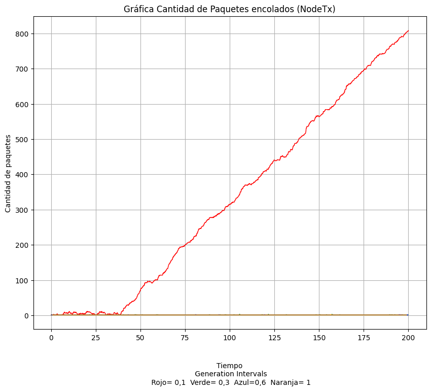</img>|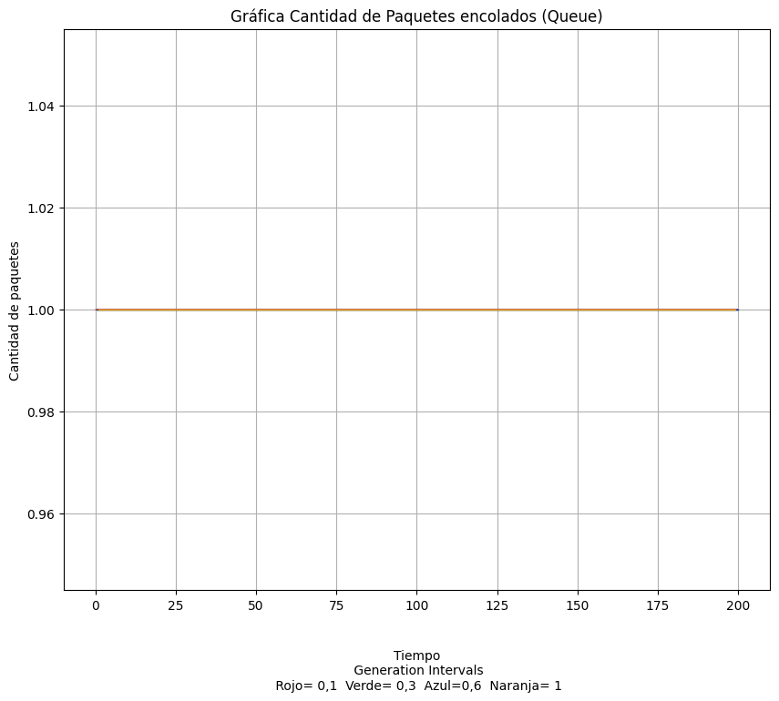</img>|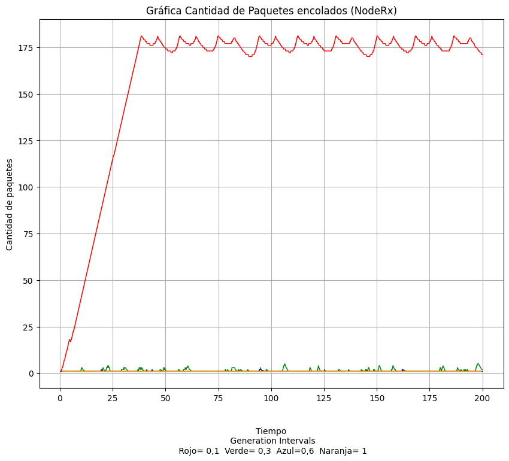</img>|
| Firgura 5.1                                         | Figura 5.2                                        | Figura 5.3                                         |

**Figura 5.1 :** Aqui podemos ver como cuando el receptor nos envia un `FeedbackPkt` y bajamos la velocidad de traTx, empezamos a encolar paquetes para asi no saturarlo(NodeRx) y que los empiece a eliminar porque su buffer se lleno.

**Figura 5.2 :** Al solo pasar los paquetes por aqui, grafico similar que la Figura 1.2.

**Figura 5.3 :** Aqui observamos como tenemos una oscilacion al rededor de 170-180, ya que al enviar los `FeedbackPkt` cuando el buffer esta al 90%, en esta red particular `Network.nodeRx.traRx.bufferSize=200` nos queda que `200*0.9=180`, nunca llegando al maximo del buffer y asi evitar la perdida de paquetes.

### Caso 2

-NodeTx a traTx: datarate = 1 Mbps y delay = 100 us

-Queue a NodeRx: datarate = 0.5 Mbps y delay = 100 us

-traRx a Sink: datarate = 1 Mbps

| NodeTx                                              | Queue                                             | NodeRx                                             |
|-----------------------------------------------------|---------------------------------------------------|----------------------------------------------------|
| 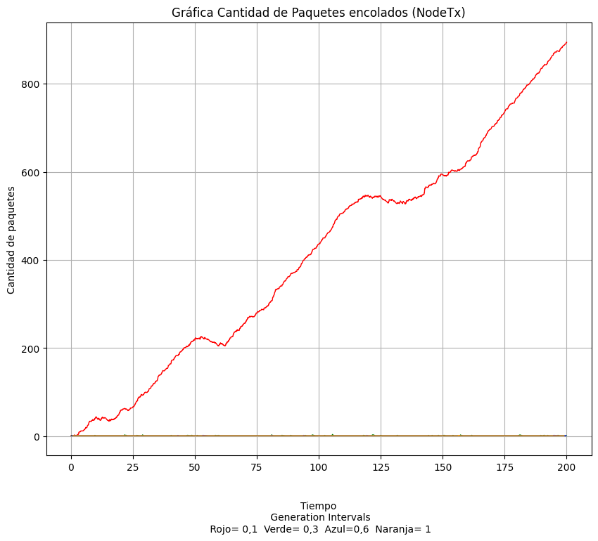</img>|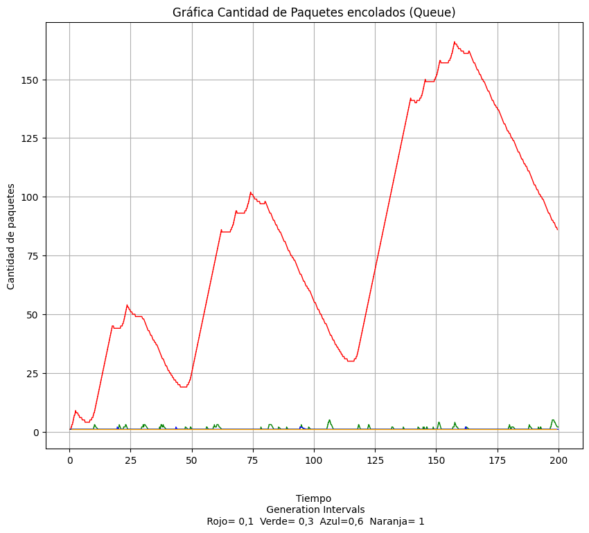</img>|</img>|
| Figura 6.1                                          | Figura 6.2                                        | Figura 6.3                                         |

**Figura 6.1 :** Obserevamos como se empiezan a encolar paquetes cuando nos avisan desde `NodeRx` que los paquetes estan teniendo delay en la red.

**Figura 6.2 :** Aqui el algortimo de control de congestion no deja que la red se sature si la comparamos con el grafico de la Figura 2.2, si comparamos con la Figura 5.3 vemos que los algoritmos regulan de manera diferente cuando empezar a mandar estos `FeedbackPkt's` y como uno oscila ampliamente desde un principo, mientras que la Figura 5.3 crece primeramente lineal com mayor pendiente, pero luego empieza a oscilar para no saturarse.

**Figura 6.3:** Similar a la Figura 2.3, no hay ningun problema, simplemente nos llega un paquete y lo pasamos.

## Discusion
Posibles mejoras:
Sobre el algoritmo de control de flujo:
- Como vimos en la figura 5.3 tenemos una oscilacion Aqui observamos como tenemos una osilacion al rededor de 170-180, en nuestro caso particular tenemos `Network.nodeRx.traRx.bufferSize=200` lo que nos permitiria como breve mejora quizas llevarlo aun mas al limite al algoritmo, llevando la oscilacion mas cerca del 200. Lo que nos permite ver la oscilacion en el grafico es asegurar que en la simulacion a pesar de extendera por un tiempo mucho mas prolongado, jamas el `nodeRx` dropearia paquetes. 
- Como vimos en la figura 5.1 tenemos un grafico que crece infinitamente, esto indica que si extendieramos el tiempo de simulacion, pues el buffer de `nodeTx` se terminaria llenando. Gracias a las condiciones principales `Network.nodeTx.traTx.bufferSize=2000000` podemos de igual manera asegurar que inevitablemente a largo plazo se llenara el buffer, cuando esto ocurra `nodeTx` comenzara a dropear paquetes, sumado al gran delay que ocurriria para un paquete que envio el emisor y entra en la posicion 2000000 del buffer de `nodeTx`.
Sobre el algoritmo de control de congestion:
- Teniendo en cuenta que las colas `Queue` son invisibles tanto para NodeRx y NodeTx se implementó un Algoritmo capaz de adaptarse en el tiempo de manera tal que no este sesgado por resultados/informacion de los primeros paquetes, este diseño hace que la cantidad de paquetes encolados en la red (`queue0`) oscile en 2 ciclos claros en tiempos 50 y 125 como se puede ver en la figura 6.2 esto sucede por que el Algoritmo reacciona al delay de los paquetes que empieza a aumentar a medida que se encolan paquetes en la red y manda una señal (`feedBack`) para que el NodeTx regule la transferencia de datos.
- Paralelamente en la figura 6.1 donde en los tiempos cercano a 50 y 125 se observan maximos locales de paquetes acumulados por que al reducir la transferencia de datos para controlar la congestion detectada por el receptor el NodeTx reacciona desminuyendo dependiendo de la severidad del retardo observado en (`percentajeDelay`), el crecimiento de la curva que se observa sucede ya que pusimos un limite superior para poder aprovechar al maximo la red pero esto limita el accionar del NodeTx a las señales de `feedBack` y tambien para evitar que la cola (red) se vacie por completo.
Extras:
- Nos hubiese gustado implementar el protocolo TCP o parecido, con los `acknowledgement`, los timeouts y reenvios de paquetes pero por problemas de tiempo no pudimos hacerlo, y tuvimos que recurrir a un algoritmo "simple" y funcional.

## Conclusiones

| Paquetes introducidos a lo largo del tiempo                     |
|-----------------------------------------------------------------|
|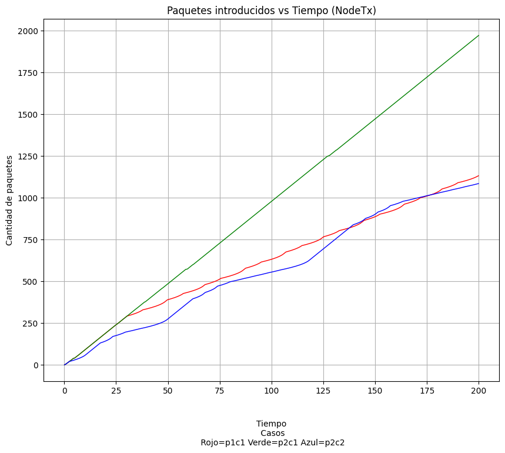</img>|
| Figura 7.1                                                      |

Gracias a la informacion plasmada en los graficos de las Figura 5.3 y Figura 1.3, podemos concluir del trabajo como nuestro algoritmo de control de flujo es muy consistene, evitando la perdida de paquetes. Lo que si cabe recalcar es que al tener un `Gen` que nunca para de generar paquetes y una simulacion limitada de tiempo, nunca terminan de llegar todos los mismos. 

Nuestra implementacion del algoritmo de contol de congestion, funciona muy bien, quizas para una simulacion mas extensa o en la practica, habria que ajustar algunos parametros.

En cuanto a Carga Util vs Carga Ofrecida como vemos en la Figura 3.1, no hay cambios debido a que tenemos un canal de la red siempre limitado con `0.5Mbps` y paquetes de `12500Byte's` tenemos que `12500x8=100000 bits (Tamaño de paquete)`, ahora `100000 bits/1000000= 0,1 Mb`, como el caudal de nuestra red es de `0.5Mbps`, solo podemos mandar hasta 5 paquetes/s. 

Si vemos la Figura 7.1 la linea verde nos indica donde no habia ningun tipo de control, por ende metiamos en la red los 2000 paquetes, de los cuales ≈1000 se perdian, en cambio en las lineas roja y azul, vemos que la cantidad de paquetes coincide con lo calculado antes. Hay ≈160 paquetes de mas en la linea roja correspondiente a los que quedan en `traRx` y unos 140 en la linea verde correspondientes a la `queue0`, por la limitacion de la simulacion.

## Referencias

- [Tanenbaum & Wetherall, 2011] Tanenbaum, A. S., & Wetherall, D. J. (2011). Redes de computadoras (5a ed.). Pearson Educación. (Capítulo 6: La Capa de Transporte)

- [Video de YouTube, 2020-05-06] Redes y Sistemas Distribuidos - Curva de Carga Ofrecida vs Carga Util. [JuanFraire]. Recuperado de https://www.youtube.com/watch?v=W8r8zSPjeAs&ab_channel=JuanFraire (Subido: 6 de mayo de 2020)

- [Video de YouTube, 2020-05-12] [MatiasBordoneCarranza]. Recuperado de https://www.youtube.com/watch?v=yq8zjLZABe0&ab_channel=MatiasEduardoBordoneCarranza (Subido: 12 de mayo de 2020)

- [Video de YouTube, 2020-05-08] [MatiasBordoneCarranza]Recuperado de https://www.youtube.com/watch?v=yL1gf04E2_E&ab_channel=MatiasEduardoBordoneCarranza (Subido: 8 de mayo de 2020)

- [Google Drive, s.f.] Recuperado de https://drive.google.com/file/d/1xx5pSrQE5PUczFH7eUAPKU23-dclSdeF/view?pli=1

## Anexo

Herramientas de inteligencia artificial:

El mayor uso que le dimos a la inteligencia artificial fue para ayudarnos a crear la notebook de Python. Básicamente, íbamos viendo los datos que guardamos en los results de la simulación e hicimos varias consultas sobre la documentación de las librerías de Python para trabajar con estos grandes paquetes de datos (pandas) y cómo dejar toda esta información plasmada en un gráfico (matplotlib). También se utilizó para poder comprender diferentes métodos y clases del proyecto con explicaciones más detalladas.

Lo utilizamos también para poder corregir bastante el formato del informe, corregir ciertas redacciones por si quedaban poco profesionales y ayudarnos con Markdown.
