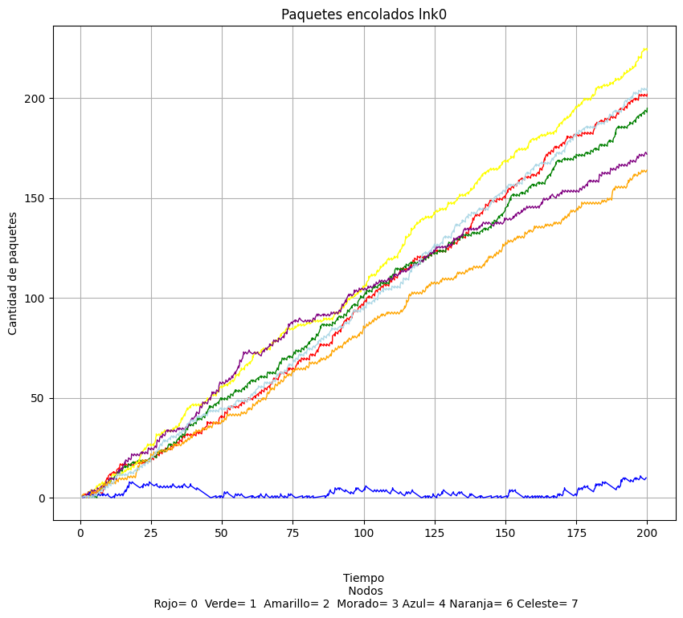
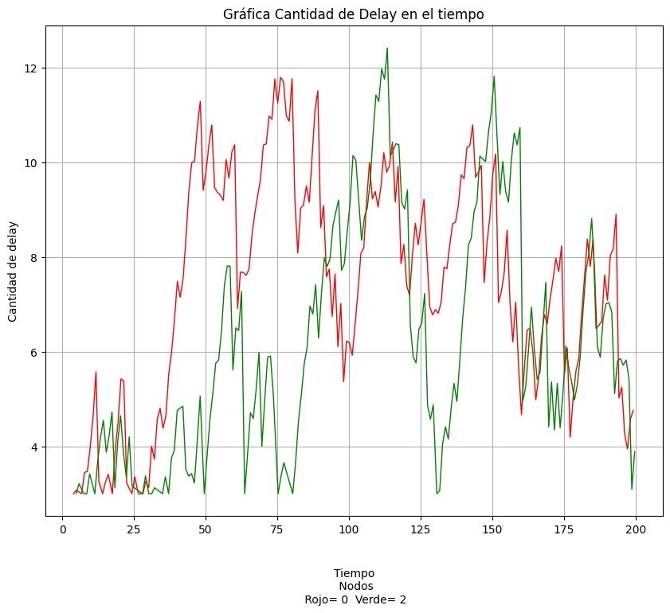

## Laboratorio 4.Capa de red. Algoritmos de enrutamiento.
Cátedra de Redes y Sistemas Distribuidos

Integrantes:

- Bustamante, Malena

- Castrillon, Tomas

- Ghisolfi, Elian

- Moisset, Hernan

## ABSTRACT/RESUMEN

En este trabajo, analizamos a fondo el algoritmo de enrutamiento proporcionado por la cátedra, el cual direcciona los paquetes siempre a través del `lnk[0]` hasta alcanzar su destino. Este análisis nos permitió aplicar el conocimiento adquirido en la teoría de la materia sobre la capa de red y sus algoritmos de enrutamiento. Nos enfocamos en la implementación de un nuevo algoritmo, combinando características de varios enfoques y reflexionando sobre posibles mejoras, especialmente en el contexto de una topología de anillo.

Identificamos diversas optimizaciones y mejoras para el algoritmo. Por ejemplo, podríamos enviar paquetes durante la fase de reconocimiento de la red o incorporar un mecanismo de feedback sobre la congestión. Esto permitiría que la decisión de enrutar un paquete no dependa únicamente del número de nodos, sino también de factores como el delay promedio por cada camino o la suma de los buffers de los nodos en cada ruta. Cabe destacar que el algoritmo actual está diseñado exclusivamente para redes con topología de anillo.

Hasta último momento, realizamos modificaciones significativas al algoritmo, basándonos en el feedback del profesor a cargo. Estas modificaciones se centraron en las responsabilidades y tareas de cada nodo, reforzando la idea de que todos los nodos tienen la misma importancia, sin jerarquías.

## INTRODUCCION

La capa de red es fundamental para el transporte de paquetes desde el origen hasta el destino. Es crucial seleccionar rutas eficientes para evitar la sobrecarga de líneas de comunicación y enrutadores, así como la inactividad de otros. Este problema se aborda mediante los algoritmos de enrutamiento, que son conjuntos de instrucciones utilizados por los routers para determinar la mejor ruta para reenviar paquetes de datos entre redes.

Para analizar y resolver estos desafíos, la simulación de redes es una herramienta invaluable. Permite modelar el comportamiento de la red bajo diversas condiciones y probar diferentes algoritmos y protocolos antes de su implementación en sistemas reales.

En este estudio, experimentamos con una red de topología de anillo compuesta por ocho nodos. Cada nodo posee dos interfaces de comunicación full-duplex conectadas a dos posibles vecinos, lo que facilita el desarrollo de algoritmos menos complejos e intuitivos.

Para llevar a cabo el trabajo, utilizamos el entorno de simulación **OMNeT++**. Nuestro objetivo principal fue investigar y proponer una solución a los problemas de enrutamiento de paquetes en una red de anillo. A través de la implementación de un algoritmo específico, buscamos mejorar la eficiencia y la calidad del servicio de la red simulada, logrando un sistema balanceado. Un sistema balanceado se caracteriza por una distribución equitativa del tráfico de datos, lo que evita la sobrecarga de los enrutadores y, consecuentemente, disminuye el delay de los paquetes.

## PARTE 1 ANALISIS

### Red Utilizada
Utilizamos la red con topología de anillo indicada por la cátedra. El algoritmo de enrutamiento proporcionado consiste en que cada nodo verifica si el paquete que ha recibido le pertenece; si es así, lo sube a la capa de aplicación; de lo contrario, lo envía por el canal `lnk[0]`. Gráficamente, esto se traduce en que los paquetes se mueven de nodo a nodo en sentido horario.

| Network                                                        | Node                                                      |
|----------------------------------------------------------------|--------------------------------------------------------------|
| </img>|</img>|
| Figura 0.1                                                     | Figura 0.2                                                   |

**Figura 0.1 :** Aca podemos observar la red con topologia anillo.

**Figura 0.2 :** Podemos ver como los nodos poseen un `lnk[0]` el cual esta conectado al node de la derecha si vemos la Figura 0.1, un `lnk[1]` que esta conectado al node de la izquierda, luego tenemos `net` que funciona como la red, es decir corre el algoritmo de enrrutamiento, decidiendo a donde enviar el paquete.

### Caso 1:
```
Network.node[{0,2}].app.interArrivalTime = exponential(1)
Network.node[{0,2}].app.packetByteSize = 125000
Network.node[{0,2}].app.destination = 5
```

Los nodos 0 y 2 transmiten paquetes aproximadamente cada un segundo, el tamaño de los paquetes son de 125000 bytes y todos los paquetes tienen destino al nodo 5. Nuestra hipótesis inicial era que ciertos nodos, como el 0, 1 y 2, se convertirían en puntos de alto uso, mientras que otros, como el 3 o el 4, tendrían una utilización mínima o nula.

| Delay                                                          | Carga buffer                                                 |
|----------------------------------------------------------------|--------------------------------------------------------------|
| </img>                |</img>          |
| Figura 1.1                                                     | Figura 1.2                                                   |

**Figura 1.1 (Delay):** Se observa un aumento significativo del delay a medida que los paquetes de `node[0]` y `node[2]` comparten la misma ruta. El `node[0]` debe alternar entre los paquetes que genera y los que recibe, lo que contribuye al retardo.

**Figura 1.2 (Carga Buffer):** Los buffers se congestionan rápidamente. Los paquetes generados por `node[0].app` se acumulan junto con los provenientes de `node[2]`, ya que la velocidad de la red es insuficiente para procesarlos a tiempo.

### Caso 2

```
Network.node[{0,1,2,3,4,6,7}].app.interArrivalTime = exponential(1)
Network.node[{0,1,2,3,4,6,7}].app.packetByteSize = 125000
Network.node[{0,1,2,3,4,6,7}].app.destination = 5
```
En este segundo caso, los nodos 0,1,2,3,4,6,7 transmiten paquetes hacia el nodo 5, aproximadamente cada un segundo.

| interArrivalTime = exponential(1)                     | interArrivalTime = exponential(2)                     |
|-------------------------------------------------------|-------------------------------------------------------|
|    |    |
| Figura 2.1                                            | Figura 2.2                                            |

| interArrivalTime = exponential(3)                     | interArrivalTime = exponential(6)                     |
|-------------------------------------------------------|-------------------------------------------------------|
|    |    |
| Figura 2.3                                            | Figura 2.4                                            |

| delay promedio con distintos ArrivalTime           |
|----------------------------------------------------|
|        |
| Figura 2.5                                         |

**Figura 2.1 (interArrivalTime = 1):** Todos los buffers de los `lnk[0]` se saturan. Los nodos deben despachar sus propios paquetes y los que provienen de otros nodos, lo que genera una sobrecarga general. El único nodo que no se sobrecarga es el `node[4]`, ya que solo envía sus propios paquetes y no recibe tráfico adicional en este sentido.

**Figura 2.2 (interArrivalTime = 2):** Al reducir la tasa de llegada de paquetes a uno cada ≈2 segundos, el `node[3]` ya no se satura como antes. Sin embargo, a partir del `node[3]` en adelante, los buffers comienzan a apilar paquetes de múltiples nodos, lo que indica que la congestión se desplaza y persiste.

**Figura 2.3 (interArrivalTime = 3):** Se repite el patrón. A medida que incrementamos el interArrivalTime, la red comienza a equilibrarse gradualmente.

**Figura 2.5 (Delay Promedio):** Se observa que a partir de un `interArrivalTime = exponential(8)`, el delay de los paquetes es muy bajo, lo que indica que la red comienza a estar equilibrada. Esto se corrobora en la Figura 2.4, donde los buffers de los `lnk[0]` apenas tienen paquetes encolados.

Tras observar los gráficos, podemos concluir que a partir de un `interArrivalTime >= 8`, la red comienza a operar de manera equilibrada. No obstante, es importante destacar que un valor demasiado alto podría llevar a una casi nula utilizacion de la red en ciertos momentos.

## Parte 2 Diseño

### METODOS

El método de enrutamiento que implementamos se basa en el descubrimiento descentralizado de la topología de la red. Al inicio de la simulación, cada nodo envía un paquete HALO con una lista vacía de nodos visitados. A medida que este paquete HALO se propaga por la red de anillo, cada nodo receptor realiza dos acciones clave:

Verifica si es el emisor original del paquete HALO.
- Si no es el emisor original, añade su propia identificación a la lista de nodos visitados dentro del paquete HALO y lo reenvía al siguiente nodo en la dirección designada (por ejemplo, lnk[0]).
        
- Si es el emisor original, significa que el paquete HALO ha completado un ciclo por la red y ha regresado a su punto de origen. En este momento, el nodo original procesa la lista completa de nodos visitados que contiene el paquete HALO.

Una vez que el nodo original ha recibido de vuelta su paquete HALO con la topología completa, utiliza esta información para construir su propia tabla de enrutamiento. Esta tabla almacena para cada posible nodo destino la interfaz de salida (lnk[0] para sentido horario o lnk[1] para sentido antihorario) que conduce al camino más corto (es decir, la ruta con la mínima cantidad de saltos).

### Caso 1

```
Network.node[{0,2}].app.interArrivalTime = exponential(1)
Network.node[{0,2}].app.packetByteSize = 125000
Network.node[{0,2}].app.destination = 5
```
En este caso, los nodos 0 y 2 transmiten paquetes aproximadamente cada segundo, con un tamaño de 125,000 bytes, todos destinados al nodo 5. Nuestra hipótesis es que, con el nuevo algoritmo, la carga de la red se distribuirá de manera más uniforme, evitando la saturación en nodos específicos.

| Delay                                         | Carga buffer                                          |
|-----------------------------------------------|-------------------------------------------------------|
|</img>|</img>|
| Figura 3.1                                    | Figura 3.2                                            |

| tabla comparativa de saltos de cada paquete        |
|----------------------------------------------------|
| |
| Figura 3.3                                         |

**Figura 3.1 (Delay):** En contraste con la Figura 1.1, donde el delay crecía linealmente hasta approx100 segundos, nuestro algoritmo logra mantener el delay oscilando entre 0 y 12 segundos. Esto representa una mejora sustancial en la eficiencia de la red.

**Figura 3.2 (Carga buffer):** En cuanto al buffer del `lnk[0]` del `node[0]` si vemos la Figura 1.2 vemos como la cola al final de la simulacion alcanzaba cerca de los 200 paquetes, mientras que con nuestro algoritmo no llega a tener mas de 10 paquetes nunca.

**Figura 3.3 (Tabla de saltos):** Se puede observar en esta tabla como aumentan considerablemente la cantidad de paquetes que llegan al destino `node[5]` como también se mejora a tal punto que se elimina los paquetes con 5 saltos. Logrando así un promedio uniforme y 23% mejor que la implementación base. 

### Caso 2

```
Network.node[{0,1,2,3,4,6,7}].app.interArrivalTime = exponential(1)
Network.node[{0,1,2,3,4,6,7}].app.packetByteSize = 125000
Network.node[{0,1,2,3,4,6,7}].app.destination = 5
```
En este segundo caso, los nodos 0,1,2,3,4,6,7 transmiten paquetes hacia el nodo 5, aproximadamente cada un segundo.

| interArrivalTime = exponential(1)                     | interArrivalTime = exponential(2)                     |
|-------------------------------------------------------|-------------------------------------------------------|
|    |    |
| Figura 4.1                                            | Figura 4.2                                            |

| interArrivalTime = exponential(3)                     | interArrivalTime = exponential(6)                     |
|-------------------------------------------------------|-------------------------------------------------------|
|    |    |
| Figura 4.3                                            | Figura 4.4                                            |

| delay promedio con distintos ArrivalTime           |
|----------------------------------------------------|
|        |
| Figura 4.5                                         |

| tabla comparativa de saltos de cada paquete        |
|----------------------------------------------------|
| |
| Figura 4.6                                         |
 
**Figura 4.1 (interArrivalTime = 1):** Se observa que el buffer del `lnk[0]` del `node[0]` permanece casi vacío durante toda la simulación, al igual que el buffer del `lnk[1]` del `node[1]`. En contraste, la Figura 2.1 mostraba que solo el buffer del `lnk[0]` del `node[4]` estaba casi vacío. Esto indica una distribución de carga mucho más eficiente.

**Figura 4.2 (interArrivalTime = 2):** Con una tasa de llegada de paquetes de ≈2 segundos, los buffers de los lnk de casi cuatro nodos están significativamente más vacíos. La Figura 2.2 solo mostraba esta mejoría en dos buffers.

**Figura 4.3 (interArrivalTime = 3):** Con un `exponential(3)`, solo un buffer experimenta una carga considerable de paquetes. Podríamos decir que la red ya se encuentra casi balanceada, un rendimiento que antes requería un `exponential(5)` aproximadamente.

**Figura 4.4 (interArrivalTime = 6):** Los buffers se encuentran casi totalmente descargados, lo que demuestra la robustez del algoritmo a tasas de tráfico moderadas.

**Figura 4.5 (Delay Promedio):** Aquí encontramos varios puntos a analizar. Cuando recibimos paquetes aproximadamente cada 1 segundo, no vemos casi cambios, la gráfica es casi igual. Ahora, cuando tenemos un `exponential(3)`, vemos cómo se achata la gráfica de delay. Si comparamos con la Figura 2.5, donde con `exponential(3)` llegaba a tener 135 segundos de delay, nuestro algoritmo logra una reducción de un 55% del delay respecto al de la cátedra. Luego, con un `exponential(5)`, la gráfica se achata totalmente, teniendo apenas delay, mientras que antes necesitábamos un `exponential(8)` o superior para conseguir un delay parecido.

**Figura 4.6 (Tabla de Saltos):** Aquí podemos observar las diferencias entre la implementación original (base del proyecto) y nuestra nueva implementación a nivel de saltos de cada paquete que llegó con éxito a la capa de aplicación. Los puntos principales en este caso es la diferencia en el promedio de saltos que realizó cada `pkt` en la red y como disminuyeron los picos máximos de saltos por paquete.

## Discusion

Nuestra primera idea fue intentar reflejar los algoritmos de enrutamiento vistos en la teoría: un reconocimiento de la red con un HALO y el cálculo de los caminos más cortos hacia los diferentes destinos, de forma similar a las tablas de enrutamiento. La primera idea que se nos ocurrió y nos pareció fácil de implementar fue el algoritmo de inundación, donde cada enrutador envía el paquete a todos los enrutadores en su alcance directo. A cada paquete le asignamos un contador de Hops que disminuye con cada enrutador por el que pasa. Eventualmente, cuando el contador de las decenas de paquetes clonados por la red llegara a 0, podrían ser descartados para dejar de saturar la red. Esto nos permitiría tener una solución no solo para el problema inicial, sino incluso para el problema en topología estrella, lo que implicaría una probable mejora de rendimiento en comparación con el algoritmo dado por la cátedra.

Al ser un grafo de ciclo (anillo), otra solución que se nos ocurrió es combinar la idea de utilizar un HALO para el reconocimiento de la red, pero guardando las conexiones en un arreglo circular. De esta manera, simplemente se enviaría el paquete por izquierda o derecha para que pasara por la menor cantidad de enrutadores en la red. Esto evitaría crear una congestión como en la inundación y nos permitiría aprovechar el hecho de que es un grafo cíclico para una implementación más sencilla que la inundación, pero más compleja que el primer método mencionado.

Inicialmente, habíamos implementado un algoritmo con un "superNodo", en nuestro caso el 0, que enviaba un HALO con un arreglo donde cada nodo se iba agregando. Finalmente, este arreglo llegaba de nuevo al nodo 0, que así obtenía conocimiento sobre la topología de la red. Después, este enviaba un paquete TopologiaRed. El profesor nos corrigió que no debería haber superNodos con otras características, teniendo en cuenta que todos los nodos son iguales y ninguno debería tener más permisos y/o responsabilidades que otros. Así que cambiamos el algoritmo de tal forma que cada nodo envíe un HALO y realice el reconocimiento de la red por sí mismo. Esto aumenta la saturación de la red al inicio, pero permite mantener la idea de que no haya nodos con mayores privilegios y/o responsabilidades.

Finalmente agregamos la funcionalidad de considerar los saltos que realizan cada paquete que llega al destino en nuestro análisis, ya que nos ayudaría a extender el alcance de nuestro algoritmo a redes con otra distribución de nodos teniendo en cuenta errores como bucles infinitos que se pueden dar en sub-anillos que podría tener la red o detectar nodos caminos ineficientes. Por otra parte para generar la tabla de decisión de cada nodo utilizamos aritmética modular que garantiza que no haya errores para N nodos que tenga la red anillo. 

El algoritmo claramente podría mejorar. Mientras se envían los paquetes HALO, se podría utilizar otro algoritmo para no pausar la red durante el reconocimiento. Podría mejorarse también de tal forma que los nodos vayan enviando feedback a los nodos 2 y 0, de modo que estos no solo elijan el camino más corto, sino también el camino con menos delay, o si la suma de los buffers de los nodos del camino es menor.

**Observación:** Nuestro algoritmo no utiliza totalmente la red. En ejemplos como, los nodos 1, 2, 3 quieren enviar paquetes al 4, nuestro algoritmo elegiría el camino más corto para enviar los paquetes, entonces todos irían en sentido antihorario. Lo que ocurriría es que todos los demás nodos no serían utilizados y, quizás, la espera de la saturación de estos nodos es más larga que si los enviásemos en sentido horario. Aunque pasara por mayor cantidad de nodos, podría llegar quizás antes el paquete y haría un mejor uso de la red. Sin embargo, implementar un algoritmo así sería extremadamente más complicado y deberíamos controlar muchos más tipos de paquetes, como avisos de baja congestión en cierta parte de la red, e ir controlando la suma de las colas por los caminos por los que pasamos en cada momento.

La función que nos permite calcular la cantidad de paquetes que pasan por un nodo es: la cantidad de paquetes que envía el nodo anterior y sumarle la cantidad de paquetes que envía el propio nodo. Esta función se extiende hasta llegar al nodo 4, donde la cantidad de paquetes que salen es la cantidad que él debe enviar al nodo 5.

Como trabajo futuro nos queda implementar el algoritmo de inundacion restringiendo por un cantidad N de saltos y correr el simulador sobre el grafo estrella. También utilizando la aritmética modular podríamos generar un mapeo para cada nodo independientemente de su posición en el anillo y poder abstraerse de la forma actual `(1)...0-7-6-5-4-3-2-1...(0)`.


## Referencias

Lista de trabajos y libros leidos a lo largo del texto. Si es una pagina de internet anotar cuando fue la captura de la pagina.

[Tanenbaum, 2011] Tanenbaum, A. S., & Wetherall, D. J. (2011). *Redes de computadoras* (5a ed.). Pearson Educación. (Capítulo 5: La Capa de Red)